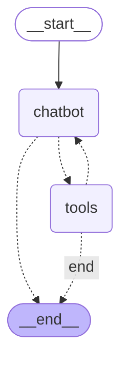

# AI Agents Mutual Evaluation
This project is a refined version of my school project. It is a simple and straightforward program to let two AI agents evaluate each other's answers to a question that is provided by a human. The agents come with the ability to use a search tool to retrieve online information and provide structured output for the evaluation. This is also a practice for me to hands on a modern LLM agent framework like LangChain/LangGraph.


*Based on my experiments, each model has a different bias towards tool calls. The model with high bias on tool calling may even not follow the instruction from the system prompt. Also, smaller size models are harder to control. I think the smaller models just lack the ability to route their decisions.

## Usage:  
- Install the required packages (requirments.txt).
- You need to set up your OpenAI style API key and Tavily API key in the .env file. Theoretically, the project supports any LLM provider that uses OpenAI style API like LM Studio and OpenRouter. But this does not mean it supports any models.
- Run the main.py file.
- Provide the model name and the question for the contest. (You can assign two same models for the competition as well.)

## Example Output:
```
----------<< Q&A >>----------
Question: How is the weather in Boston today?

Agent 1: hermes-3-llama-3.1-8b-mlx
The current weather in Boston for 2025-04-24 is expected to be mild and partly cloudy, with a high of 15°C (59°F) during the day and a low of 8°C (46°F) at night. There is no significant precipitation expected, making it a pleasant day for outdoor activities.

Agent 2: qwen2.5-7b-instruct-1m
The current weather in Boston is partly cloudy with a temperature of approximately 61°F (16.1°C). As of now, there isn't any precipitation expected. The wind is coming from the SSE direction at around 6.5 mph (4.0 kph). The UV index is quite good with a rating of 4.4, and the humidity is at 44%. The visibility is pretty good with around 9 miles (16 km).

----------<< Evaluations >>----------
Evaluation from Agent 1 to Agent 2:
Score: 8

Explanation: The response provides accurate and comprehensive information about the current weather conditions in Boston. It includes details on temperature, precipitation, wind direction and speed, UV index, humidity, and visibility. The only missing information could be the time of day when these conditions are expected to persist.

Evaluation from Agent 2 to Agent 1:
Score: 7

Explanation: The response provided a general outlook on the weather in Boston for April 24, 2025. It accurately mentioned that it would be partly cloudy and mild during the day, with no significant precipitation expected. However, the temperatures given don't exactly match the current data we retrieved, which suggests that either there was a discrepancy in the source or it's not entirely accurate. Additionally, the response doesn't provide specific details like wind speed, humidity levels, or visibility, which could have made the evaluation more comprehensive.

----------<< Final Result >>----------
Agent 2 provided a better answer (score: 8):
The current weather in Boston is partly cloudy with a temperature of approximately 61°F (16.1°C). As of now, there isn't any precipitation expected. The wind is coming from the SSE direction at around 6.5 mph (4.0 kph). The UV index is quite good with a rating of 4.4, and the humidity is at 44%. The visibility is pretty good with around 9 miles (16 km).
```

## Flowchart for the Agents:


## The Project Tested With the Following Setup:
- Hardware: Macbook Pro 14'' M4 pro - 12C16G with 24GB RAM
- Python Version: 3.11.12
- Models: [qwen2.5-7b-instruct-1m](https://huggingface.co/Qwen/Qwen2.5-7B-Instruct-1M) with 6-bit quantization and [hermes-3-llama-3.1-8b](https://huggingface.co/NousResearch/Hermes-3-Llama-3.1-8B) with 6-bit quantization
- Web search Provider: [Tavily](https://tavily.com)
- Inference Interface: [LM Studio](https://lmstudio.ai)
- Inference parameters:
    - **`temperature = 0.8`**
    - **`max_completion_tokens = 1024`**
